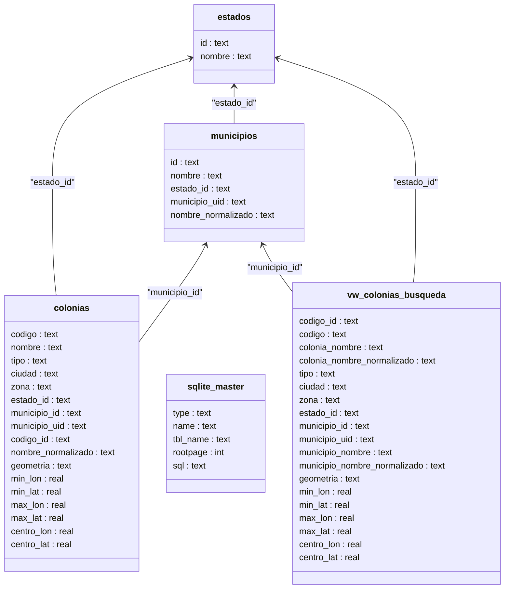

# 🇲🇽 MexPost Data
## Base de Datos de Codigos Postales y GeoJSON de Mexico (SEPOMEX)

[](https://www.python.org/)
[](https://www.sqlite.org/)
[](LICENSE)
[![LinkedIn][linkedin-shield]][linkedin-url]

Pipeline ETL reproducible para descargar, normalizar y cruzar el catalogo oficial de codigos
postales de Mexico (SEPOMEX) con limites geograficos GeoJSON. Genera dos bases de datos
SQLite listas para integracion en APIs, busqueda postal y casos de uso geoespacial.

- `dist/db_postal.sqlite`: base de datos relacional para consultas postales de alto rendimiento.
- `dist/db_geo.sqlite`: base de datos con geometria GeoJSON, bounding boxes y centroides.

---

## Abstract (English)

`base-datos-postales` is an open-source ETL pipeline that transforms SEPOMEX postal open data
into two production-ready SQLite databases: a lightweight relational database for fast lookup
workloads and a geospatial database enriched with GeoJSON polygons, bounding boxes, and
centroids.

The pipeline includes deterministic normalization, duplicate-safe identifiers, optimized SQLite
batch loading, search-focused indexes, and a geographic coverage audit log for postal codes
without matching geometry.

## Resumen (Espanol)

`base-datos-postales` convierte los datos abiertos de SEPOMEX en dos salidas SQLite listas para
produccion: una version relacional ligera para autocompletado y busqueda, y una version espacial
con geometria GeoJSON para geocodificacion inversa y analitica territorial.

Incluye normalizacion relacional, identificadores estables, carga masiva optimizada con PRAGMAs
de SQLite, indices de consulta y auditoria automatica de codigos postales sin cobertura
geografica.

---

## Objetivo

Proveer una fuente de verdad postal reproducible, auditable y actualizable para Mexico, evitando
el uso de snapshots estaticos desactualizados y facilitando su integracion en sistemas reales.

## Caracteristicas Principales

- Extraccion automatizada de SEPOMEX desde datos abiertos oficiales.
- Normalizacion en tablas relacionales (`estados`, `municipios`, `colonias`) con deduplicacion.
- Identificadores estables (`codigo_id`, `municipio_uid`) para integridad y joins robustos.
- Inyeccion de geometria GeoJSON por codigo postal en `db_geo.sqlite`.
- Calculo de bounding box (`min_lon`, `min_lat`, `max_lon`, `max_lat`) y centroide
  (`centro_lon`, `centro_lat`).
- Resolucion de duplicados GeoJSON priorizando poligonos con bbox valido.
- Indices simples, compuestos (`COLLATE NOCASE`) y espaciales para consultas en milisegundos.
- Vista `vw_colonias_busqueda` para consultas directas de colonia + municipio.
- Log de auditoria (`dist/db_geo_errores.log`) para codigos sin geometria asignada.

## Fuentes de Datos

1. SEPOMEX open data:
   https://www.correosdemexico.gob.mx/datosabiertos/cp/cpdescarga.txt
2. GeoJSON boundaries:
   https://github.com/open-mexico/mexico-geojson

## Estructura del Repositorio

```text
.
├── datos_geojson/            # GeoJSON polygons per state (input source)
├── dist/                     # Generated outputs (ignored by git)
├── docs/                     # Project documentation and notebook guidelines
├── scripts/                  # Utility scripts (checks and automation)
├── src/                      # ETL modules (extract, transform, load, utils, main)
├── tests/                    # Pytest test suite and fixtures
├── mkdocs.yml                # Documentation site configuration
├── pyproject.toml            # Project metadata + quality tool settings
├── requirements.txt          # Runtime dependencies
└── requirements-dev.txt      # Development and QA dependencies
```

## Estructura dase de datos

> [!IMPORTANT]  
> Esta es el diagrama completo con los datos geometricos (GeoJSON).




## Instalacion y Uso

### 1. Clonar el repositorio

```bash
git clone https://github.com/open-mexico/sepomex-db-generator.git
cd sepomex-db-generator
```

### 2. Configurar entorno reproducible

Opcion A: `virtualenv` (recomendada)

```bash
python3 -m venv .venv
source .venv/bin/activate
pip install --upgrade pip
pip install -r requirements-dev.txt
```

Opcion B: `conda`

```bash
conda create -n mexpost python=3.11 -y
conda activate mexpost
pip install --upgrade pip
pip install -r requirements-dev.txt
```

### 3. Ejecutar el pipeline ETL

```bash
python -m src.main
```

Tambien puedes usar el entrypoint del proyecto:

```bash
mexpost-etl
```

Variables de entorno opcionales:

- `SEPOMEX_URL`: reemplazo de la URL de origen.
- `GEOJSON_PATH`: ruta al directorio local de GeoJSON.
- `OUTPUT_DIR`: directorio de salida para las bases generadas.

## Modelo de Datos para Busqueda

El proceso ETL incluye una relacion explicita entre colonias y municipios para consultas rapidas
y precisas:

- `municipios.municipio_uid`: formato
  `{estado_id}-{municipio_id}-{nombre_municipio_normalizado}`.
- `colonias.municipio_uid`: clave de relacion directa a `municipios.municipio_uid`.
- `colonias.codigo_id`: identificador estable por estado + codigo postal + nombre.
- `vw_colonias_busqueda`: vista denormalizada para consumo inmediato.

Restricciones de integridad via indices `UNIQUE`:

- `colonias(codigo_id)`
- `municipios(municipio_uid)`

Ejemplo:

```sql
SELECT codigo, colonia_nombre, municipio_nombre
FROM vw_colonias_busqueda
WHERE codigo = '01000' AND colonia_nombre_normalizado = 'san angel';
```

## Consultas SQL de Ejemplo

```sql
-- Buscar colonias por codigo postal
SELECT codigo, colonia_nombre, municipio_nombre
FROM vw_colonias_busqueda
WHERE codigo = '06600';

-- Autocompletado por nombre normalizado
SELECT codigo, colonia_nombre, municipio_nombre
FROM vw_colonias_busqueda
WHERE colonia_nombre_normalizado LIKE 'roma%'
LIMIT 10;

-- Filtro por bounding box (db_geo.sqlite)
SELECT codigo, colonia_nombre, municipio_nombre
FROM vw_colonias_busqueda
WHERE min_lat <= 19.4326 AND max_lat >= 19.4326
  AND min_lon <= -99.1332 AND max_lon >= -99.1332;
```

## Pruebas y Calidad

```bash
# Lint
ruff check .

# Format check
ruff format --check .

# Tests + coverage threshold
pytest
```

Tasks definidos en `pyproject.toml`:

```bash
poe check
poe fix
```

## Pre-commit

```bash
pre-commit install
pre-commit run --all-files
```

## Documentacion

```bash
mkdocs build --strict
mkdocs serve
```

Paginas principales:

- `docs/index.md`
- `docs/nb_guide.md`

## Integracion Continua

El workflow de GitHub Actions valida:

- `ruff check .`
- `ruff format --check .`
- `pytest` con cobertura (artefacto `coverage.xml`)
- validacion opcional de notebooks cuando existan

## Contribuir

Consulta `CONTRIBUTING.md` antes de abrir un pull request.

## Licencia

Este proyecto esta licenciado bajo BSD 3-Clause. Ver `LICENSE`.

> Los datos originales de SEPOMEX estan sujetos a los terminos de uso de datos abiertos del
> Gobierno de Mexico.

## Palabras Clave SEO

codigos postales Mexico, SEPOMEX SQLite, base de datos postal Mexico, GeoJSON colonias Mexico,
geocodificacion inversa Mexico, ETL Python SEPOMEX, base de datos geoespacial Mexico,
colonias municipios estados Mexico, open data Mexico, CP Mexico API.

[linkedin-shield]: https://img.shields.io/badge/-LinkedIn-black.svg?style=flat-square&logo=linkedin&colorB=555
[linkedin-url]: https://www.linkedin.com/in/macarthuror/